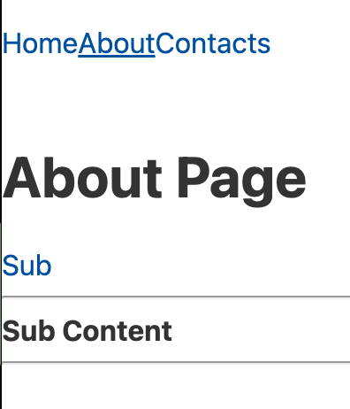
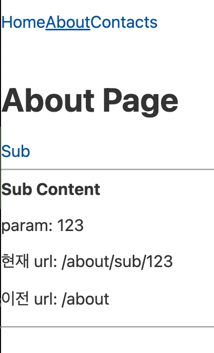
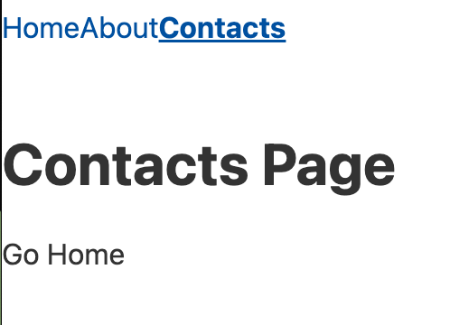

# 9. 라우터(Router)

## 1. 라우터란?

---

URL에 의해 페이지를 표시하는 기능을 Routing이라고 하고 이 기능을 구현해 주는 장치를 Router라고 한다
라우터는 SPA 서비스를 만드는 데 있어서 필수 기능
Svelte에서는 기본적ㅇ로 라우터를 지원하지 않지만 다양한 서드파티 라우터가 있음

- **svelte-routing**: https://github.com/EmilTholin/svelte-routing
- **svelte-spa-router**: https://github.com/italyPaleAle/svelte-spa-router
- **tinro**: https://github.com/AlexxNB/tinro#getting-started
- **routify**: https://routify.dev
- **root-svelte-router**: https://github.com/PierBover/roots-svelte-router
- **svelte-stack-router**: https://github.com/cdellacqua/svelte-stack-router

## 2. tinro 설치

---

프로젝트 생성
```bash
$ npx degit sveltejs/template svelte-router
```

tinro 설치
```bash
$ npm i -D tinro
```

package.json의 start에 `--single` 코드를 추가해야 tinro를 이용한 라우팅이 오류없이 작동함
```json
"scripts": {
  "build": "rollup -c",
  "dev": "rollup -c -w",
  "start": "sirv public --single --no-clear" // --single 추가
}
```

## 3. 라우팅 기능

---

tinro의 Route import
```html
<script>
  import {Route} from 'tinro';
</script>
```

Route 사용
```html
<Route path="/주소"><!-- 컴포넌트 또는 마크업--> </Route>
```

- Fallback - 404 No Page Found
```html
<Route fallback>404 페이지</Route>
```

- Redirect
  `redirect="/home"`을 설정하면 기본 주소로 접속을 하더라도 자동으로 `/home`으로 이동

- Links
```html
<a href="/page" use:active>Link</a>
```


## 4. 중첩 라우팅

---

- **중첩 라우팅**: 메인 주소 아래에 하위 요소를 필요로 할 때 사용하는 기능

```html
<Route path="/about/*">
  <About />
  <Route path="/sub">
    <SubContent />
  </Route>
</Route>
```

하위 주소를 사용할 경우 경로 다음에 꼭 `*`를 사용해야 한다


중첩 링크를 앱의 디자인 요소에 맞춰서 유연하게 배치할 수 있다




## 5. 파라미터 전달 및 받기

---

URL을 통해 값을 전달하고, 또 그 전달된 값을 받아서 사용

```html
<Route path="/sub/:전달값이름">...</Route>
```




## 6. 프로그래밍 제어

---

라우팅 제어 방법



URL 주소 제어
```js
router.goto('/foo'); //URL: /foo
router.location.query.set('name','alex'); //URL: /foo?name=alex
router.location.hash.set('bar'); //URL: /foo?name=alex#bar
router.location.query.set('page',1); //URL: /foo?name=alex&page=1#bar
router.location.query.replace({hello: 'world'}); //URL: /foo?hello=world#bar
router.location.query.clear(); //URL: /foo#bar
router.location.hash.clear(); //URL: /foo
```


## 7. 화면 전환

---

`svelte/transition` 화면전환 효과 적용