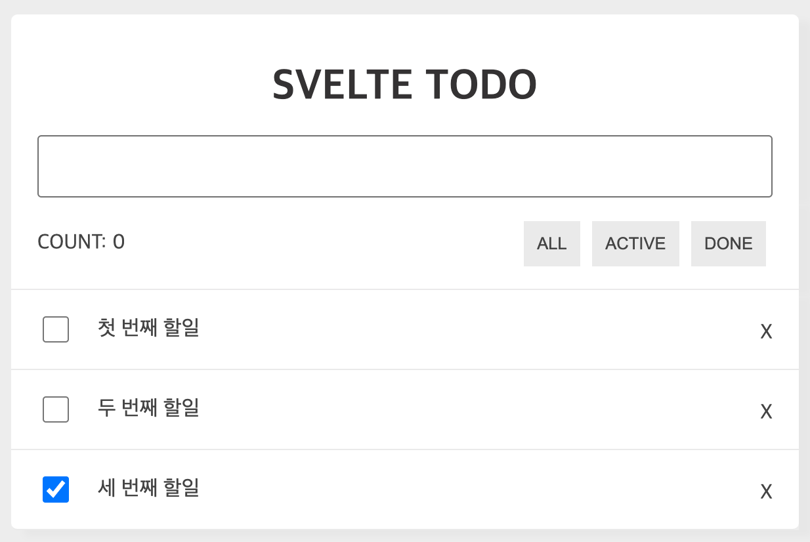
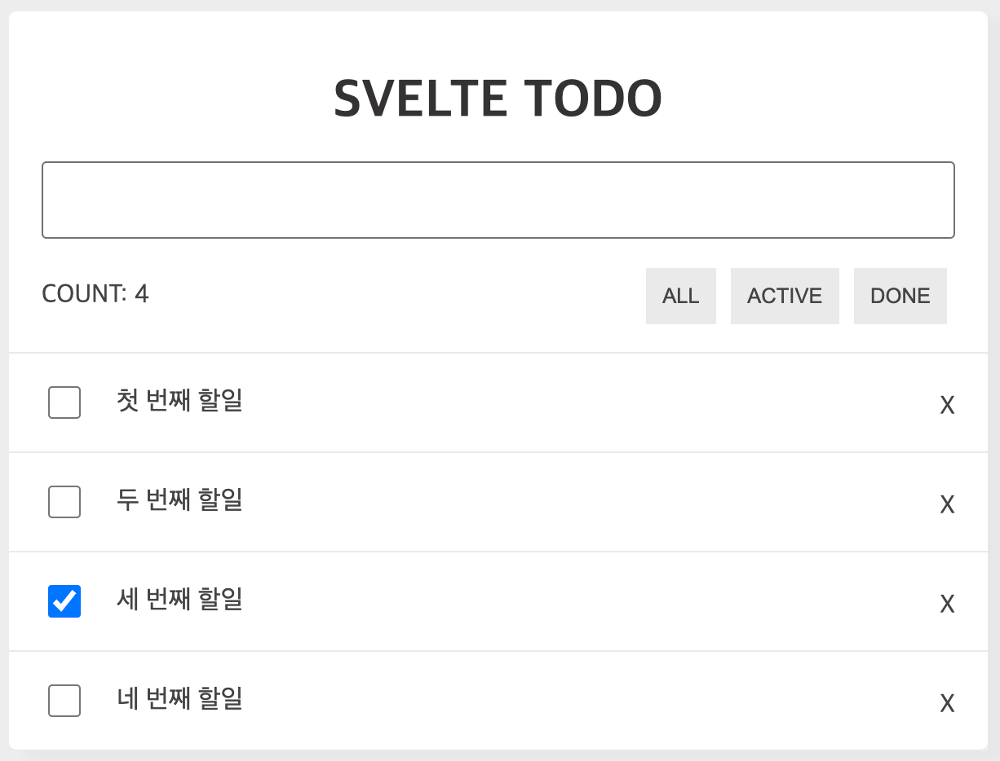
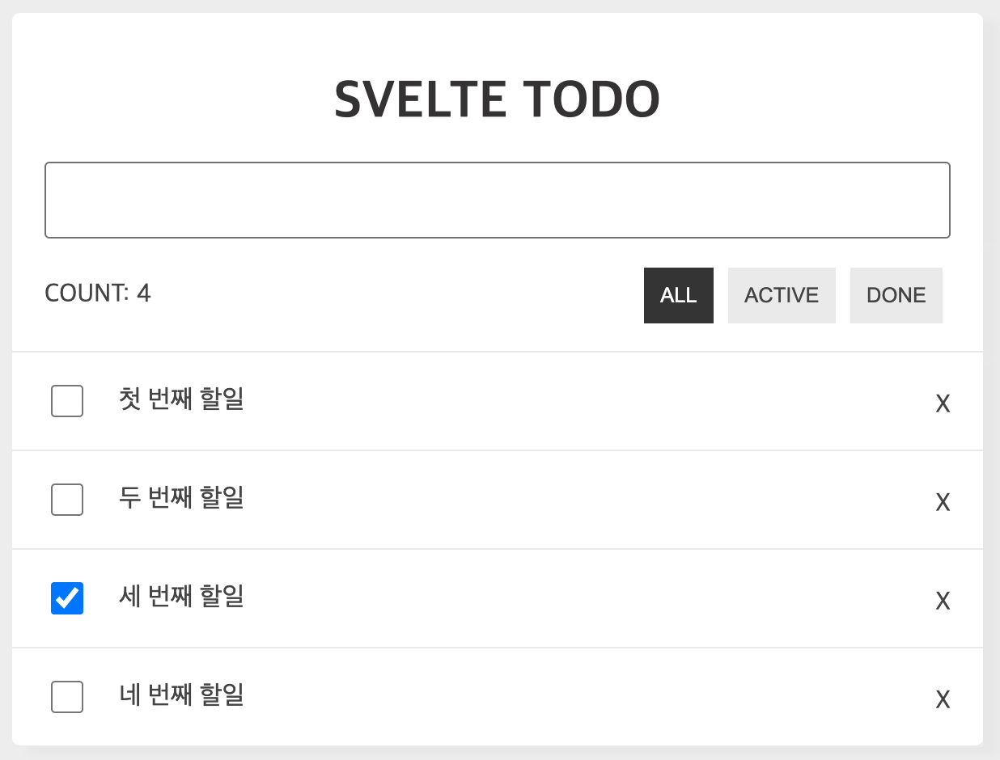

# 8. 실전 프로젝트(1) Todo 서비스 만들기

## 1. Todo 프로젝트 설명

---

### 1.1 Todo 서비스 기능
- TodoHeader 컴포넌트
- TodoInfo 컴포넌트
- TodoList 컴포넌트
- TodoItem 컴포넌트

### 1.2 기본 환경설정
Svelte Template 프로젝트 생성 및 설치
```bash
$ npx digit sveltejs/template ./
$ npm install
```

실행
```
$ npm run dev
```

설치 경로
```bash
설치경로
├── node_modules
├── public
│   ├── favicon.png
│   ├── global.css
│   └── index.html
├── scripts
├── src
│   ├── App.svelte
│   └── main.js
├── package.json
└── rollup.config.js
```

`/public/global.css`교체


## 2. 컴포넌트 배치

---

기본적인 컴포넌트 배치
```bash
...
├── src
│   ├── components
│   │   ├── TodoHeader.svelte // 추가
│   │   ├── TodoInfo.svelte // 추가
│   │   ├── TodoList.svelte // 추가
│   │   └── TodoItem.svelte // 추가
│   ├── App.svelte
│   └── main.js
...
```


## 3. Todo 리스트 출력

---

uuid 패키지 설치
```bash
$ npm i uuid
```

Todos 목록 상태값을 만들고 상태값과 메소드들은 Props를 통해서 전달하는 구조

- 단방향 바인딩의 경우 꼭 원본 데이터, 즉 부모의 데이터를 변경해야 한다
- 마크업 영역에서 이벤트에 인자를 전달할 경우에는 꼭 화살표함수 형태로 입력을 해야 정상 작동한다

check 값이 true인 목록에 체크박스가 체크됨


## 4. Todo 입력

---

할일이 추가되는 과정
1. `input` 텍스트와 `todoValue`를 바인딩
2. `input` 텍스트박스에 값을 입력하고 엔터를 치면 `handleTodoInputKeyup(e)`에서 엔터키 감지
3. `handleTodoInputKeyup(e)`에 엔터키가 감지되면 `addTodoItem()`을 호출
4. `addTodoItem()`은 Todos에 `todoValue`를 포함한 새로운 객체를 만들어 배열에 추가

`TodoHeader` 컴포넌트에 바인딩을 이용해서 상태값은 양방향으로 연동


## 5. Todo 삭제

---

`handleRemoveTodo()` 메소드를 만들고 Props로 TodoList 컴포넌트를 거쳐 TodoItem에 전달해 실행




## 6. Todo 수정

---

내용을 더블클릭하면 텍스트 박스로 변경되고 이곳에 변경된 내용을 입력하고 커서를 다른 곳으로 옮기면 저장

1. 할 일에 대한 더블클릭이 일어나면 `handleChangeEditMode`에 의해 상태값 `editMode`에 해당하는 일의 `id`가 입력됨
2. Todo 목록의 `id`와 `editMode`가 같은 텍스트박스로 변경돼서 나타남
3. 입력이 완료된 후 커서를 밖으로 옮기면 `handleEditTodoItem`에 의해서 수정이 일어남
4. `closeEditMode`에 의해 `editMode`가 초기화되고 수정모드 해제


## 7. count & Todo 보기모드

---

등록된 할 일의 개수와 할 일의 상태별 보기모드를 선택하는 기능
### 7.1 count: 할 일 개수
Todos 상태값의 객체 사이즈만 체크해서 전달



### 7.2 보기모드: 모두 보기 ∙ 진행 ∙ 완료
보기모드 **ALL(모두 보기)**, **ACTIVE(진행)**, **DONE(완료)** 구현

```js
// filter를 이용해 todo.done이 true인 값으로 todos 재할당
todos = todos.filter(todo => todo.done === true)
```

`$: {}` 블록 안에 있는 값들은 특별한 호출이 없이도 상태값에 따라서 선언적으로 작동된다

- **ALL(모두 보기)**: `fetchTodos = Todos`
- **ACTIVE(todo.done 이 false인 경우)**: `fetchTodos = todos.filter(todo => todo.done === false);`
- **DONE(todo.done이 true인 경우)**: `fetchTodos = todos.filter(todo => todo.done === true);`

`constant.js` **상수(변하지 않는 값)** 를 만들어 사용



