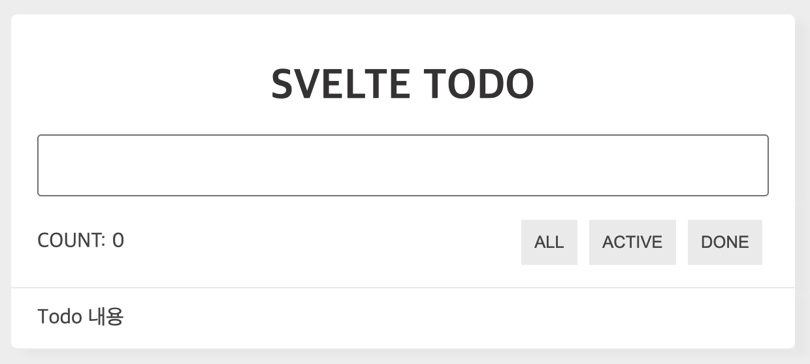
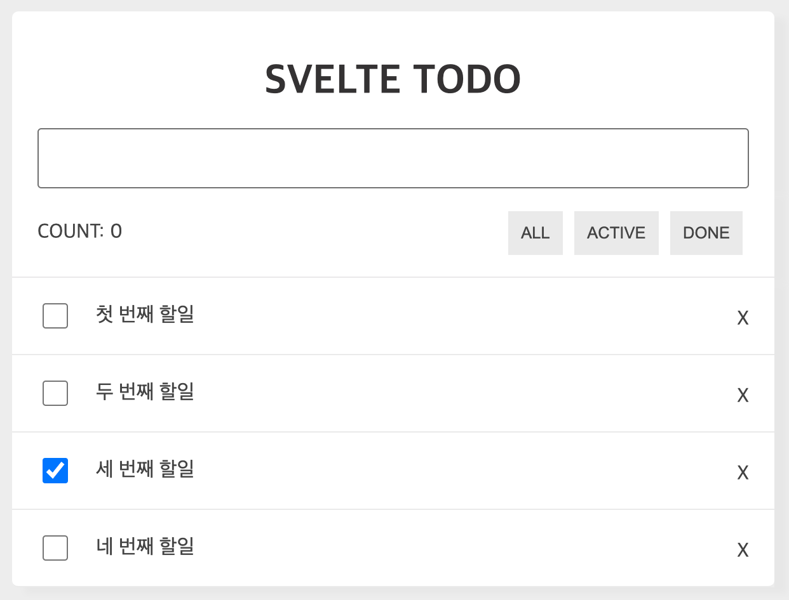
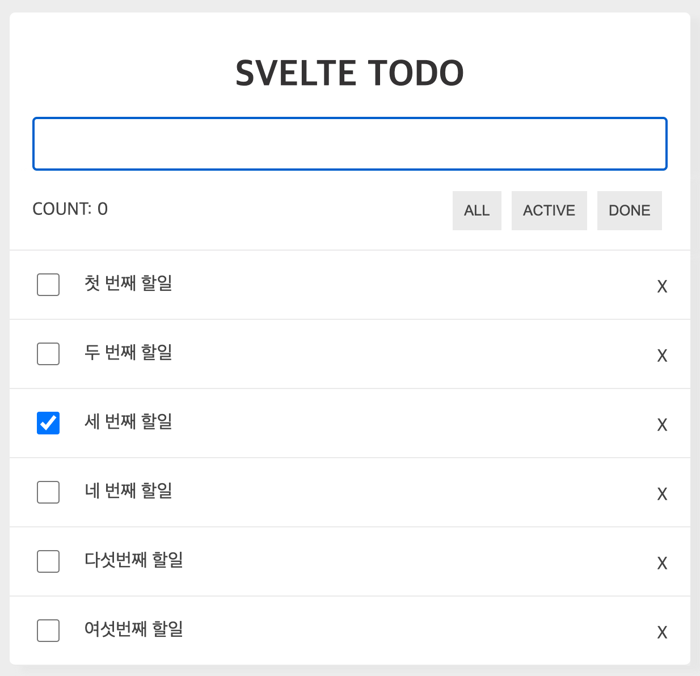

# 8. 실전 프로젝트(1) Todo 서비스 만들기

## 1. Todo 프로젝트 설명

---

### 1.1 Todo 서비스 기능
- TodoHeader 컴포넌트
- TodoInfo 컴포넌트
- TodoList 컴포넌트
- TodoItem 컴포넌트

### 1.2 기본 환경설정
Svelte Template 프로젝트 생성 및 설치
```bash
$ npx digit sveltejs/template ./
$ npm install
```

실행
```
$ npm run dev
```

설치 경로
```bash
설치경로
├── node_modules
├── public
│   ├── favicon.png
│   ├── global.css
│   └── index.html
├── scripts
├── src
│   ├── App.svelte
│   └── main.js
├── package.json
└── rollup.config.js
```

`/public/global.css`교체


## 2. 컴포넌트 배치

---

기본적인 컴포넌트 배치
```bash
...
├── src
│   ├── components
│   │   ├── TodoHeader.svelte // 추가
│   │   ├── TodoInfo.svelte // 추가
│   │   ├── TodoList.svelte // 추가
│   │   └── TodoItem.svelte // 추가
│   ├── App.svelte
│   └── main.js
...
```




## 3. Todo 리스트 출력

---

uuid 패키지 설치
```bash
$ npm i uuid
```

Todos 목록 상태값을 만들고 상태값과 메소드들은 Props를 통해서 전달하는 구조

- 단방향 바인딩의 경우 꼭 원본 데이터, 즉 부모의 데이터를 변경해야 한다
- 마크업 영역에서 이벤트에 인자를 전달할 경우에는 꼭 화살표함수 형태로 입력을 해야 정상 작동한다

check 값이 true인 목록에 체크박스가 체크됨



## 4. Todo 입력
---

할일이 추가되는 과정
1. `input` 텍스트와 `todoValue`를 바인딩
2. `input` 텍스트박스에 값을 입력하고 엔터를 치면 `handleTodoInputKeyup(e)`에서 엔터키 감지
3. `handleTodoInputKeyup(e)`에 엔터키가 감지되면 `addTodoItem()`을 호출
4. `addTodoItem()`은 Todos에 `todoValue`를 포함한 새로운 객체를 만들어 배열에 추가

`TodoHeader` 컴포넌트에 바인딩을 이용해서 상태값은 양방향으로 연동



